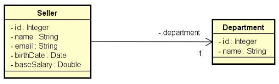

# Interface Gráfica com JavaF

Trata-se de um projeto java com interface gráfica JavaFX, utilizando boas práticas de programação combinado com um sistema de **Vendedores** e **Departamentos**, no qual o intuito foi implementar as quatros operações de crud, sendo elas:

- Create: Criar ou adicionar novas entradas
- Read (Retrieve): Ler, recuperar ou ver entradas existentes
- Update: Atualizar ou editar entradas existentes
- Delete: Atualizar ou editar entradas existentes

## Entidades

## Pré-requisitos

- Você precisa compreender a linguagem Java e conceitos de POO (Encapsulamento, herança e polimorfismo)
- Você precisa compreender expressões lambdas
- Você precisa compreender acesso a dados com JDBC
- Você precisa compreender JavaFX
- Você precisa compreender Mysql
- Você precisa compreender MVC (Model, View & Controler)

## Padrão de projeto utilizados

1. MVC
2. Observer
3. DAO (Data Acess Object)

## **Tecnologias empregadas**

- Mysql com JDBC
- JavaFx

## Boas práticas de programação implementado nesse projeto

- Divisão de camadas de MVC, deixando a separação destas muito claras na questão de visualização e regra de negócio
- Nomes claros às variáveis
- Identação do código (Básico)
- Utilização de operadores ternários, deixando o código mais enxuto
- Padrões de nomeclatura
- Utilização de **try-catch** para lidar com as exceções

## Informação de desenvolvimento
- Eclipse package: 2022-09
- JDK 17 (LTS)
- JavaFX SDK: 17 (LTS)
- S.O: Linux Mint 21
### VM Arguments reference
``--module-path "/home/user/libs/javafx-sdk/lib" --add-modules=javafx.fxml,javafx.controls``

## Informações do banco de dados utilizado

Para compor este projeto, utilizei o banco de dados relacional **Mysql** para fazer a relação entre as entidades, lembrando que não há nenhum ***ORM*** empregado para criação automática das tabelas.

### Script para gerar banco de dados: [aqui](https://github.com/AlissonWenceslau/workshop-javafx-jdbc/blob/main/script.sql)

### Tabela de Vendedores

### Tabela de Departamentos

## Imagens do sistema rodando

### Ver vendedores

### Criar vendedores

### Editar vendedores

### Deletar vendedores

### Redes Sociais:

